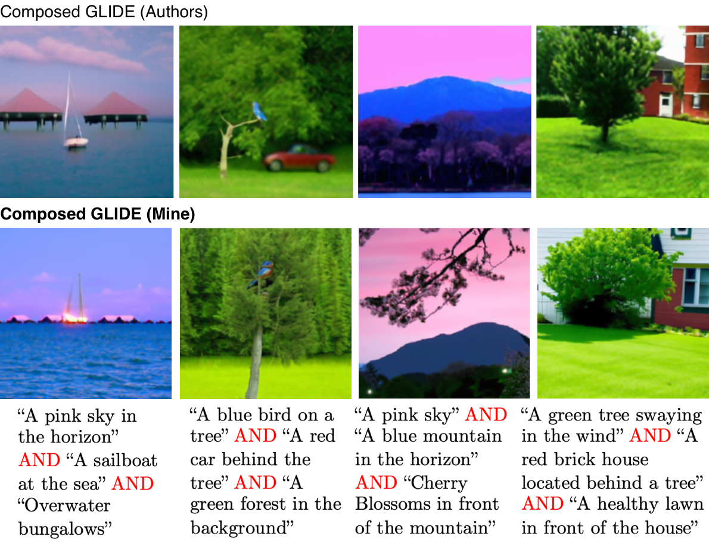

# 🎨 Replication of "Compositional Visual Generation with Composable Diffusion Models" with Compose GLIDE

ComposeGlide is an enhanced text-to-image generation framework built on OpenAI's GLIDE diffusion models. It provides improved compositional control, attention visualization capabilities, and specialized models for face generation.



## ✨ Features

- 🖼️ High-quality text-to-image generation
- 🧩 Enhanced compositional control over image elements
- 👤 Specialized face generation capabilities
- 🔍 Attention map visualization for model interpretability
- 🔄 Fine-tuning support for custom datasets
- 🚀 Simple API for integration into downstream applications

## ⬇️ Installation

### Prerequisites:

- Python 3.7+
- PyTorch 1.9+
- CUDA-compatible GPU (recommended)
- 32GB RAM (recommended)

```python
# Installation steps
git clone --recursive https://github.com/denskrlv/compose-glide.git
cd compose-glide

# First install the local dependency
pip install -e ./glide-text2im

# Then install the main package
pip install -e .
```

### Models

Fine-tuned model and binary classifiers can be downloaded using [this link](https://drive.google.com/drive/folders/1r0Zre539MPNyhWIQy5F9UXaNIOX06VXE?usp=sharing). After downloading, put both files into models folder.

## 🚀 Quick Start

```python
from compose_glide import ComposeGlide

# Initialize the model
compose_glide = ComposeGlide(model_name='glide_faces', verbose=True)
print(compose_glide)

PROMPT = "..."

# Generate an image from text
result, attention_data = compose_glide.generate(
    PROMPT, 
    num_images=NUM_IMAGES, 
    upsample=UPSAMPLE, 
    upsample_temp=0.995,
    save_intermediate_steps=10,
    return_attention_maps=True
)

# Save the image
image.save("portrait.png")
```

## 🦾 Fine-tuning

ComposeGlide supports custom fine-tuning on CelebA (using the provided data loader):

```python
python -m src.scripts.fine_tune \
    --dataset_path /path/to/dataset \
    --output_dir ./models/custom \
    --batch_size 8 \
    --epochs 10
```

## ⚛️ Project Structure

```markdown
compose-glide/
├── src/                       # Core source code
│   └── compose_glide/         # Main package
├── models/                    # Model checkpoints
└── notebooks/                 # Jupyter notebooks
```

## 📋 References

Original authors:

**[GLIDE: Towards Photorealistic Image Generation and Editing with Text-Guided Diffusion Models](https://arxiv.org/abs/2112.10741)** - Nichol, A., Dhariwal, P., Ramesh, A., Shyam, P., Mishkin, P., McGrew, B., Sutskever, I., & Chen, M. (2022)

Additional papers:

**[Compositional Visual Generation with Composable Diffusion Models](https://arxiv.org/abs/2206.01714)** - Liu, N., Li, S., Du, Y., Torralba, A., & Tenenbaum, J.
